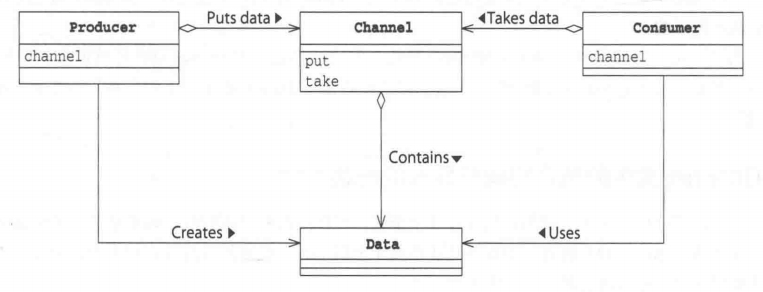

Java设计模式入门教程

相信在第一单元作业中，你已经接触并使用工厂模式，对设计模式有了一个初步的认识。在本教程中，我们将对设计模式进行进一步介绍，并列举一些本单元可能用到设计模式，帮助同学们更合理地解决设计过程中遇到的一些问题，简单快捷地实现本次电梯作业。

## 什么是设计模式

设计模式（Design Pattern）是前辈们对代码开发经验的总结，是解决特定问题的一系列套路。它不是语法规定，而是一套用来提高代码可复用性、可维护性、可读性、稳健性以及安全性的解决方案。

#### 设计模式的六大原则

**1、开闭原则（Open Close Principle）**

开闭原则的意思是：**对扩展开放，对修改关闭**。在程序需要进行拓展的时候，不能去修改原有的代码，实现一个热插拔的效果。简言之，是为了使程序的扩展性好，易于维护和升级。想要达到这样的效果，我们需要使用接口和抽象类，后面的具体设计中我们会提到这点。

**2、里氏代换原则（Liskov Substitution Principle）**

里氏代换原则是面向对象设计的基本原则之一。 里氏代换原则中说，任何基类可以出现的地方，子类一定可以出现。LSP 是继承复用的基石，只有当派生类可以替换掉基类，且软件单位的功能不受到影响时，基类才能真正被复用，而派生类也能够在基类的基础上增加新的行为。里氏代换原则是对开闭原则的补充。实现开闭原则的关键步骤就是抽象化，而基类与子类的继承关系就是抽象化的具体实现，所以里氏代换原则是对实现抽象化的具体步骤的规范。

**3、依赖倒转原则（Dependence Inversion Principle）**

这个原则是开闭原则的基础，具体内容：针对接口编程，依赖于抽象而不依赖于具体。

**4、接口隔离原则（Interface Segregation Principle）**

这个原则的意思是：使用多个隔离的接口，比使用单个接口要好。它还有另外一个意思是：降低类之间的耦合度。由此可见，其实设计模式就是从大型软件架构出发、便于升级和维护的软件设计思想，它强调降低依赖，降低耦合。

**5、迪米特法则，又称最少知道原则（Demeter Principle）**

最少知道原则是指：一个实体应当尽量少地与其他实体之间发生相互作用，使得系统功能模块相对独立。

**6、合成复用原则（Composite Reuse Principle）**

合成复用原则是指：尽量使用合成/聚合的方式，而不是使用继承。

## 单例模式

#### 为什么要引入单例模式

对于系统中的某些类来讲，我们要求它只有一个实例存在。例如，一个系统中可以存在多个打印任务，但是只能有一个正在工作的任务；一个系统只能有一个窗口管理器或文件系统；一个系统只能有一个计时工具或ID（序号）生成器。基于此需求，我们引入单例模式。

#### 模式定义

单例模式(Singleton Pattern)：单例模式确保某一个类只有一个实例，而且自行实例化并向整个系统提供这个实例，这个类称为单例类，它提供全局访问的方法。

#### 模式结构


#### 代码实现

```java
public class SingleObject {
   //创建 SingleObject 的一个对象， 在类的定义时已经实例化
   private static SingleObject instance = new SingleObject(); 
   //让构造函数为 private，这样该类就不会被实例化
   private SingleObject(){} 
    
   //获取唯一可用的对象
   //通过类来调用此方法，所以该方法是静态的。静态方法只能够调用类中的静态数据，所以类内创建的对象 instance 也是静态的
   public static SingleObject getInstance(){
      return instance;
   }
 
   public void showMessage(){
      System.out.println("Hello World!");
   }
}
```

```java
public class SingletonPatternDemo {
   public static void main(String[] args) {
      //编译时错误：构造函数 SingleObject() 是不可见的
      //SingleObject object = new SingleObject();
 
      //获取唯一可用的对象
      SingleObject object = SingleObject.getInstance();
 
      //显示消息
      object.showMessage();
   }
}
```

## 观察者模式

#### 为什么要引入观察者模式

当我们需要建立一种对象与对象之间的依赖关系，一个对象发生改变时将自动通知其他对象，其他对象将相应做出反应时，我们引入观察者模式。典型的例子有微信公众号订阅与通知系统。

在此，发生改变的对象称为观察目标，而被通知的对象称为观察者。一个观察目标可以对应多个观察者，而且这些观察者之间没有相互联系，可以根据需要增加和删除观察者，使得系统更易于扩展。在微信公众号订阅与通知系统中，观察目标是微信公众号，观察者为订阅此公众号的用户。

#### 模式定义

观察者模式(Observer Pattern)：定义对象间的一种一对多依赖关系，使得每当一个对象状态发生改变时，其相关依赖对象皆得到通知并被自动更新。

#### 模式结构

- Subject: 目标
- ConcreteSubject: 具体目标
- Observer: 观察者
- ConcreteObserver: 具体观察者


#### 代码实现

```java
// 创建被观察的目标类
import java.util.ArrayList;
import java.util.List;
 
public class Subject {
   
   private List<Observer> observers 
      = new ArrayList<Observer>();
   private int state;
 
   public int getState() {
      return state;
   }
 
   public void setState(int state) {
      this.state = state;
      notifyAllObservers();
   }
 
   public void attach(Observer observer){
      observers.add(observer);      
   }
 
   public void notifyAllObservers(){
      for (Observer observer : observers) {
         observer.update();
      }
   }  
}
```

```java
// 创建抽象类 Observer 
// 抽象类本身被设计成只能用于被继承，因此，抽象类可以强迫子类实现其定义的抽象方法，否则编译会报错。
public abstract class Observer {
   protected Subject subject;
   public abstract void update();
}
```

```java
// 创建实体观察者类
public class BinaryObserver extends Observer{
 
   public BinaryObserver(Subject subject){
      this.subject = subject;
      this.subject.attach(this);
   }
 
   @Override
   public void update() {
      System.out.println( "Binary String: " 
      + Integer.toBinaryString( subject.getState() ) ); 
   }
}
```

```java
public class ObserverPatternDemo {
   public static void main(String[] args) {
      Subject subject = new Subject();
 
      new BinaryObserver(subject);
 
      System.out.println("First state change: 15");   
      subject.setState(15);
      System.out.println("Second state change: 10");  
      subject.setState(10);
   }
}
```

## 生产者消费者模式

#### 为什么要引入生产者消费者模式

在线程世界里，生产者是负责产生数据数据的线程，消费者就是处理数据的线程。

生产者安全地将数据交给消费者。虽然看起来这是很简单的操作，但是当生产者消费者以不同的线程运行时，两者之间的速度差异会引起问题。如，消费者想要获取数据，数据还未生成；生产者想要交付数据，消费者还无法接收数据。

#### 模式定义

生产者消费者模式是通过一个缓冲区来解决生产者和消费者的强耦合问题。生产者和消费者彼此之间不直接通讯，而通过缓冲区来进行通讯，进而消除了不同线程间处理速度的差异。

生产者生产完数据之后不用等待消费者处理，直接移交缓冲区，消费者直接从缓冲区里取数据。缓冲区的存在平衡了生产者和消费者的处理能力。

#### 模式结构



#### 代码实现

```java
// 主线程，测试生产者消费者模式
public class ProducerConsumerTest {
   public static void main(String[] args) {
      CubbyHole c = new CubbyHole();
      Producer p1 = new Producer(c, 1);
      Consumer c1 = new Consumer(c, 1);
      p1.start(); 
      c1.start();
   }
}
```

```java
// 缓冲区
class CubbyHole {
   private int contents;
   private boolean available = false;
   public synchronized int get() {
      while (available == false) {
         try {
            wait();
         }
         catch (InterruptedException e) {
         }
      }
      available = false;
      notifyAll();
      return contents;
   }
   public synchronized void put(int value) {
      while (available == true) {
         try {
            wait();
         }
         catch (InterruptedException e) { 
         } 
      }
      contents = value;
      available = true;
      notifyAll();
   }
}
```

```java
// 消费者线程
class Consumer extends Thread {
   private CubbyHole cubbyhole;
   private int number;
   public Consumer(CubbyHole c, int number) {
      cubbyhole = c;
      this.number = number;
   }
   public void run() {
      int value = 0;
         for (int i = 0; i < 10; i++) {
            value = cubbyhole.get();
            System.out.println("消费者 #" + this.number+ " got: " + value);
         }
    }
}
```

```java
//  生产者线程
class Producer extends Thread {
   private CubbyHole cubbyhole;
   private int number;

   public Producer(CubbyHole c, int number) {
      cubbyhole = c;
      this.number = number;
   }

   public void run() {
      for (int i = 0; i < 10; i++) {
         cubbyhole.put(i);
         System.out.println("生产者 #" + this.number + " put: " + i);
         try {
            sleep((int)(Math.random() * 100));
         } catch (InterruptedException e) { }
      }
   }
} 
```

