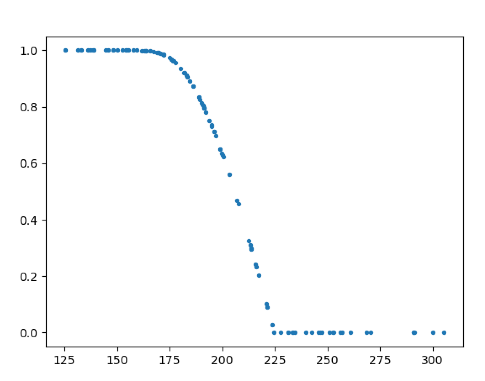

# 面向对象电梯系列第二次指导书

## 摘要

本次作业，需要完成的任务为**多部多线程可捎带调度电梯**的模拟

## 问题

### 电梯系统说明

本次作业需要模拟一个多线程实时电梯系统，首先从标准读入中读取模拟电梯数目，动态建立电梯，从标准输入中输入请求信息，程序进行接收和处理，模拟电梯运行，将必要的运行信息通过输出接口进行输出。

本次作业所有电梯功能一致，具体为为：上下行，开关门，每运行一层的时间为固定值，开关门的时间为**相同的固定值**。

电梯系统可以采用任意的调度策略，即上行还是下行，是否在某层开关门，都可自定义，只要保证在**系统限制时间内**将所有的乘客送至目的地即可。

电梯系统在某一层开关门时间内可以上下乘客，**开关门的边界时间都可以上下乘客**。

### 电梯运行基本概念

- 电梯系统时间：程序开始运行的时间
- 电梯楼层：-3层到-1层，1层到16层，共19层
- 电梯初始位置：1层
- 电梯数量：多部(1-5部），分别编号为`A`，`B`，`C`，`D`，`E`
- 电梯最大载客量：7人
- 电梯上升或下降一层的时间：0.4s
- 电梯开关门的时间：开门0.2s，关门0.2s，共计0.4s，到达楼层后方可立刻开门，关门完毕后方可立刻出发。
- 电梯内部初始乘客数目：0

### 电梯请求说明

本次作业的电梯，为一种比较特殊的电梯，学名叫做**目的选层电梯**（可以百度一下，确实是存在的，且已经投入了主流市场）。

大概意思是，**在电梯的每层入口，都有一个输入装置，让每个乘客输入自己的目的楼层**。电梯基于这样的一个目的地选择系统进行调度，将乘客运送到指定的目标楼层。

所以，一个电梯请求包含这个人的**出发楼层和目的楼层**，以及这个人的id（保证人员id唯一），请求内容将作为一个整体送入电梯系统，在整个运行过程中请求内容不会发生改变。

## 输入输出

### 输入

- 输入一律在标准输入中进行。
- 本次电梯作业使用以人为单位的请求模式，即包含一个人的id，出发楼层，目标楼层，出发楼层和目标楼层不能相同。
- **输入格式：**数字+人的请求。
  - 数字表示创建可运行电梯的数目
  - 人的请求标准格式为`id-FROM-x-TO-y`，其中一条指令一行，id是人的唯一标识，x，y是属于楼层范围的一个整数，分别代表出发楼层和目标楼层。
- 在所有电梯输入之前，需要先输入电梯个数。
- 课程组会下发对应的输入解析（ElevatorInput）程序，自动解析标准输入之中的内容并转换为`PersonRequest`对象返回给使用者。如果输入中有格式错误，或者存在id重复，或是出发楼层和目标楼层相同，解析程序只会读取到正确的请求，错误的将跳过并在标准异常中输出错误信息（不影响程序本身运行，也不会引发RUNTIME_ERROR）。具体的接口使用信息请参考**电梯第二次作业输入接口文档**。
- 本次的输入为实时交互，评测机可以做到在某个时间点投放一定量的输入。

### 输出

- 输出一律使用课程组提供的接口进行输出，一条输出内容占一行，接口中会自动**附加输出时的电梯系统时间**。此外，任何其他信息**绝对不要**输出在标准输出中<del>，更不要试图伪造假时间假输出蒙混过关</del>，否则将会影响评测，且后果自负。
- 输出信息包括**电梯的状态**和**人的状态**，其中elevator表示电梯编号（取值为`A`、`B`、`C`、`D`、`E`）
  - 电梯的状态，分为**三种**，OPEN(开门)，CLOSE(关门)，ARRIVE（到达）
    -   开门格式：OPEN-楼层-elevator（在开门刚开始输出）
    -   关门格式：CLOSE-楼层-elevator（在关门刚结束输出）
    -   到达格式：ARRIVE-楼层-elevator（在刚刚到达该楼层时输出）
  - 人的状态，分为两种，IN(进入电梯)，OUT(离开电梯)
    -   进入电梯格式：IN-id-楼层-elevator，这里的id是这个人自己的id
    -   离开电梯格式：OUT-id-楼层-elevator
- 具体输出时，使用者需要将格式字符串作为对应的参数传入官方输出接口中，接口内部会自动加上时间戳输出到标准输出。简单来说，和println使用方法大致类似，具体请参考**输出接口文档**。

### 样例

<table border="1" width="960px">
    <thead>
        <tr>
            <th>#</th>
            <th>输入</th>
            <th>输出</th>
            <th>说明</th>
        </tr>
    </thead>
    <tbody>
       <tr>
           	<td width = "100px">1</td>
      		<td width = "200px">[0.0]1 [1.0]1-FROM-1-TO-2</td>
            <td width = "300px">[    1.0100]OPEN-1-A [    1.0120]IN-1-1-A [    1.4110]CLOSE-1-A [    1.9120]ARRIVE-2-A [    1.9130]OPEN-2-A [    1.9130]OUT-1-2-A [    2.3140]CLOSE-2-A</td>
      		<td width = "360px">显然</td>
        </tr>
        <tr>
           	<td>2</td>
      		<td>[0.0]1 [1.0]1-FROM-1-TO-2 [1.0]2-FROM-1-TO-2</td>
            <td>[    1.0120]OPEN-1-A [    1.0160]IN-1-1-A [    1.0170]IN-2-1-A [    1.4120]CLOSE-1-A [    1.9120]ARRIVE-2-A [    1.9120]OPEN-2-A [    1.9130]OUT-1-2-A [    1.9130]OUT-2-2-A [    2.3120]CLOSE-2-A</td>
            <td>电梯可以采用ALS调度策略，乘客1成为主请求，乘客2满足捎带条件故捎带</td>
        </tr>
        <tr>
           	<td>3</td>
            <td>[0.0]2 [1.5]1-FROM-1-TO-2</td>
            <td>[1.3870]OPEN-1-B [1.3910]IN-1-1-B [1.7930]CLOSE-1-B [2.2940]ARRIVE-2-B [2.2940]OPEN-2-B [2.2940]OUT-1-2-B [2.6940]CLOSE-2-B</td>
      		<td>输入的起始时间可以不从1.0开始 <b>（此处存在时间计测同步性问题，在样例说明部分会有详细的说明）</b> 多部电梯运行可自选请求分配策略和电梯调度策略</td>
        </tr>
        <tr>
           	<td>4</td>
            <td>[0.0]3 [2.2]1-FROM-1-TO-3 [2.3]2-FROM-2-TO-4</td>
            <td>[    2.2060]OPEN-1-C [    2.2070]IN-1-1-C [    2.6070]CLOSE-1-C [    2.8020]ARRIVE-2-B [    2.8030]OPEN-2-B [    2.8030]IN-2-2-B [    3.2070]ARRIVE-2-C [    3.2070]CLOSE-2-B [    3.7070]ARRIVE-3-B [    3.8070]ARRIVE-3-C [    3.8080]OPEN-3-C [    3.8080]OUT-1-3-C [    4.2080]ARRIVE-4-B [    4.2090]OPEN-4-B [    4.2090]OUT-2-4-B [    4.2090]CLOSE-3-C [    4.6090]CLOSE-4-B</td>
            <td>多电梯合作，可同时执行多条请求</td>
        </tr>
</tbody>

说明：

- 为了方便说明，指导书上提供的输入为这样的格式：`[x.x]yyyyyyyy`。
- 意思是在`x.x`这个时间点（相对于程序运行开始的时间，单位秒），输入`yyyyyyyy`这样的一行数据。
- 关于上面说到的时间计测同步性问题，在这里解释一下：
  - 直观地说，可能会观察到输入指令时间晚于做出反应的时间这一现象。
  - 这个实际上不是程序的错误，而是由于评测机投放数据的系统、和程序输出接口，这两边的时间可能存在不同步导致的。
  - **这一问题是由于多线程测试不可避免的波动性导致的计时同步性误差，属于正常现象，不会被认定为错误**。（<del>当然，也不会出现故意提早的情况，因为程序本身就是实时交互，不可能做得到预知未来</del>）

## 关于判定

### 数据基本限制

- 可输入电梯系统的指令数上限：min{30+10*电梯数， 50}条。
- 电梯系统总执行时间上限为200s，具体是指电梯执行完最后一条指令关门时的时间。
- 第一条指令的输入时间在1s及1s以后
- 在强测中，数据均满足
  -   对于请求内容本身，保证不手动构造边界数据或者针对某种算法
  -   请求数不超过50条
  -   最后一条请求一定不迟于40s输入
  -   保证正常的程序不会超过时间上限，也**会避免使用对边界情况较为敏感的数据**。
- 在互测时，数据提供者所使用的数据必须满足
  -   输入合法，输出结果正确
  -   对于输入，第一条输入请求不迟于5s
  -   对于输出，最后一条调度输出时间不超过70s（即总调度时间不超过70s）
  -   更多详细信息请见下方互测部分。

### 正确性判断

电梯系统运行的正确性判断只根据以下四点：

- 电梯运行逻辑合理，即
  - 电梯在两个楼层之间的运行时间**大于等于**理论运行时间
  - 电梯开关门的时间**大于等于**理论开关门时间
  - 电梯**必须停下才能开门**，开门到关门期间，禁止移动，电梯**关门完毕后才可以继续移动**
  - 电梯在开门到关门的时间闭区间内，才可以进行上下人的行为
  - 而且，上下人行为的输出顺序必须介于开门和关门之间
    - 即对于这样的例子，即便输出时间上符合要求
      - `OUT-1-1-A`
      - `OPEN-1-A`
      - `CLOSE-1-A`
    - 也是属于错误的，**`IN`、`OUT`必须在一对相邻的`OPEN`、`CLOSE`之间**
  - 关于ARRIVE
    - 当且仅当电梯到达每个楼层（即楼层发生改变）时，必须立刻输出且仅输出一次ARRIVE信息。
    - 忽略其他输出的话，每两个相邻ARRIVE之间，必须刚好只差一层楼。即，**禁止跳层**，即便时间是对的。
    - 在电梯的开关门之间，不允许ARRIVE。
    - **当且仅当电梯ARRIVE到了某一层，才可以在这个楼层上进行开门、上下人、关门的动作**。
  - 关于电梯载客量
    -   **电梯任何时候，内部的人数都必须小于等于轿厢容量限制**。
    -   也就是说，即便在OPEN、CLOSE中间，也不允许出现超过容量限制的中间情况。
- 人员运行逻辑合理，假设请求为`ID-FROM-X-TO-Y`，则
  - 发出指令时，人员处于电梯外的X层
  - 人员进入电梯后，人员将处于电梯内，且必须是**电梯外的当前停靠层的人员才可以进入电梯**
  - 人员离开电梯后，人员将处于电梯外的当前停靠层，且必须是**电梯内的人员才可以离开电梯**
  - 人员不在电梯内的时候，不会有自行移动的行为。即，可以理解为人员会一直待在原地
- 在电梯运行结束时，所有的乘客都已经到达各自的目标楼层电梯外，且电梯都已经关上了门。
- 所有电梯满足该电梯的最大容量限制，评测机内部会维护对应的计数器，根据每部电梯的输入输出情况进行正确性判断。
<<<<<<< HEAD
- 故如果有程序运行结果正确但总时间超过了电梯系统总执行时间上限，那么会视为错误。
- **满足上述五条要求的一切调度结果都是正确的**
=======
- **满足上述四条要求的一切调度结果都是正确的**
>>>>>>> ab6e19df99786ca9c2f18e9edb96857018e818a9

### 性能要求

-   我们以电梯系统的总运行时间作为性能指标。
-   本次的性能要求，均为200s。
-   故如果有程序运行结果正确但总时间超过了电梯系统总执行时间上限，那么会视为错误。

#### 性能分判定

在本次作业中，性能分的唯一评判依据，是电梯的总运行时间$T$。

设某同学给出的正确答案的电梯运行时长为$T_p$，所有人目前给出的正确答案的电梯运行时长的最小值为$T_{min}$，最大值为$T_{max}$，平均值为$T_{avg}$。

设 

$base_{min} = p\cdot T_{avg}+(1-p)\cdot T_{min}$，

$base_{max}=p\cdot T_{max}+(1-p)\cdot T_{avg}$，

$p=0.25$

则该同学性能分百分比为：
$$
r(T_p)= 100 \% \cdot\begin{cases}1 & T_p \leq base_{min} \\1-10^{1-\frac{base_{max}-base_{min}}{T_p-base_{min}}} & base_{min} < T_p \leq base_{max} \\0 & T_p > base_{max}\end{cases}
$$
  以下是用正态分布生成的一组数据，模拟的性能分得分情况，

  注意

- **获得性能分的前提是，在正确性判定环节被判定为正确**。如果被判定为错误，则性能分部分为0分。
- 本次作业性能分占比**20%**

### 其他评测时要求

- 从本次作业开始，严格限制CPU时间，**即程序运行CPU时间限制为10s，超出即视为该测试点未通过**。目的是限制暴力轮询的行为，建议**尽量使用notify、wait来解决问题**。
- 本次作业**明确要求使用多线程**
- 关于调度策略，大家可以比较后选优。任何使用重定向hack输出接口的作业将作为作弊作业处理。

## 互测输入要求

互测样例输入数据需要额外附加时间项，评测系统将使用请求发射器在对应的时间将请求送入标准输入。

即互测时的输入格式为`[time]id-FROM-x-TO-y`，其中time是一个保留一位小数的浮点数，比如`0.0`,`1.5`,`2.2`等。电梯个数请使用`[0.0]n`格式给出

### 互测样例输入基本限制总结

- 输入严格符合标准格式，不存在格式错误
- 整个输入序列中不存在重复的人员id，且人员id为int范围内的非负整数
- 整个输入序列中不存在出发楼层和目的楼层相同的请求指令
- 整个输入序列中的时间必须单调递增（不一定严格递增，但是禁止出现递减的情况）
- 满足指令数上限要求
- 第一条输入请求不迟于5s，不早于1s
- 所提供的标准输出正确，且最后一条输出时间不得迟于70s（即调度时间不超过70s）
- 系统会检测是否符合如上7条基本限制，如果不符合的样例将会禁止进入互测

## 提示

- 如果还有人不知道标准输入、标准输出是啥的话，那在这里解释一下
  - 标准输入，直观来说就是屏幕输入
  - 标准输出，直观来说就是屏幕输出
  - 标准异常，直观来说就是报错的时候那堆红字
  - 想更加详细的了解的话，请去百度
- 关于本次的调度策略
  -   本次调度策略自由空间很大，大家可以相对自由的发挥。
  -   如果有自己觉得更好（更好写、或效率更高）的调度方式，欢迎自行探索和研究，可以获得更大的性能分收益。
- 关于这次的架构，可以采用这样的模式：
  - 主线程进行输入的管理，使用ElevatorInput，负责接收请求并存入队列
  - 构建一个调度器（本次的调度器可以和队列是一体的）
    - 用于管理请求
    - 和电梯进行交互并指派任务给电梯
    - 且**需要保证调度器是线程安全的**
  - 构建电梯线程，负责和调度器进行交互（比如每到一层进行一个交互）接收任务，并按照一定的局部策略进行执行。
  - 设计的重点依然在于**最大限度降低耦合，每个对象只应该管自己该管的事**。
  - 以上只是建议，如果有自己觉得更好的设计，欢迎自行探索和研究。
- 关于接口的一些使用，可以在idea里面，按Ctrl+Q。将可以看到类和方法的使用格式以及注释。
- 友情提醒：**请不要为了那点性能分而在架构设计上大开倒车**。所有人的最终目的都是学到知识而不是紧扣分数。而且，冒着出现大量BUG的风险，拿一个工程性极差的架构来赌博式地追求性能分，很可能并不划算，一旦正确性错了就会血本无归。**真正靠谱的架构，一定是可以做到兼顾正确性和性能优化的**。长远来看，好好优化架构才是拿高分唯一正确的思路，而不是剑走偏锋甚至于本末倒置。
